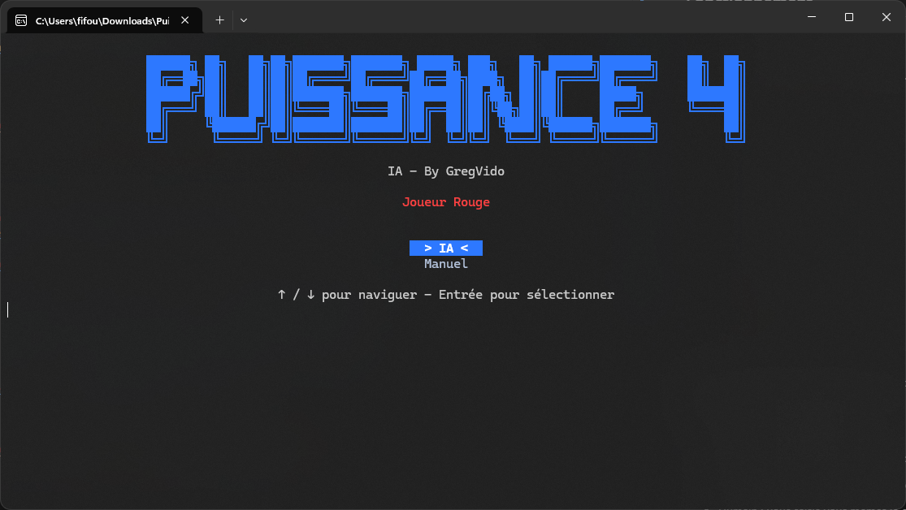
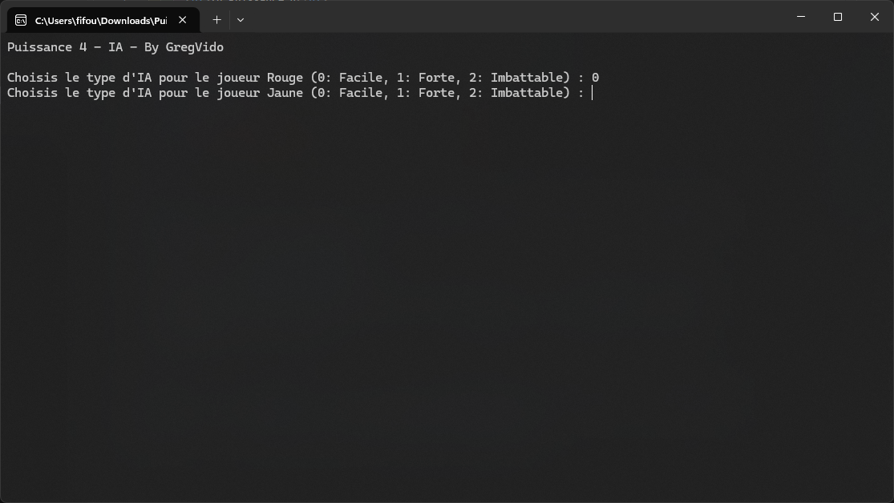
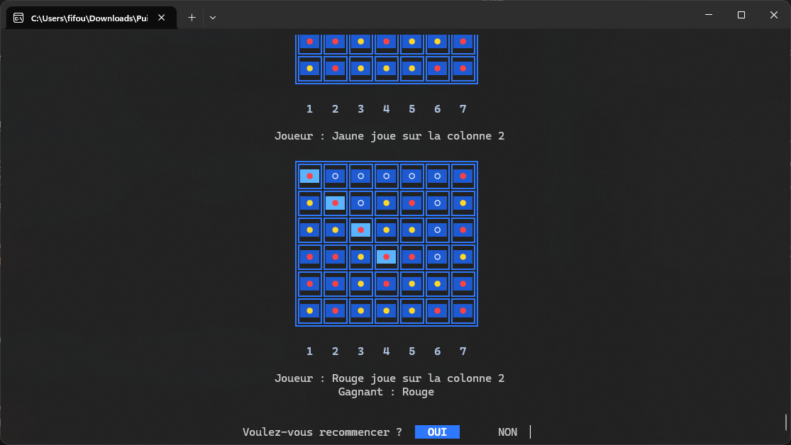
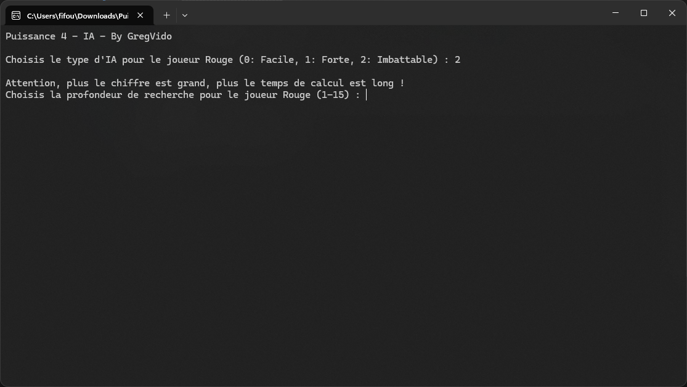

<table width="100%">
  <tr>
    <td width="100">
      
    </td>
    <td width="700" align="center">
      <h1>IA Puissance 4</h1>
    </td>
  </tr>
</table>

<i>Fait combattre des IA entre elles !!</i>

## Fonctionnement

  

 

Lorsque vous lancez l'application, elle vous demandera qu'elle IA choisir pour le joueur Rouge. 
Chaque IA a son propre compoortement.

- Facile : L'IA joue aleatoirement.
- Forte : Elle analyse la partie en cours pour jouer les coups qui lui permettra de gagner à coups sûr.
- Imbattable : Comme la forte, mais beaucoup plus performante, et précise dans sa logique d'interpretation de la partie.

  

 

Une fois l'IA séléctionnée, l'application vous demandera quelle IA choisir pour le joueur Jaune. 
Dès que l'IA sera choisis, la partie commancera automatiquement.

  

 

Lorsque la partie est finie, vous avez le choix de regarder chaque étape de la partie, de recommancer un nouveau combat, ou alors de quitter l'application.

## Profondeur de rechercher

  

 